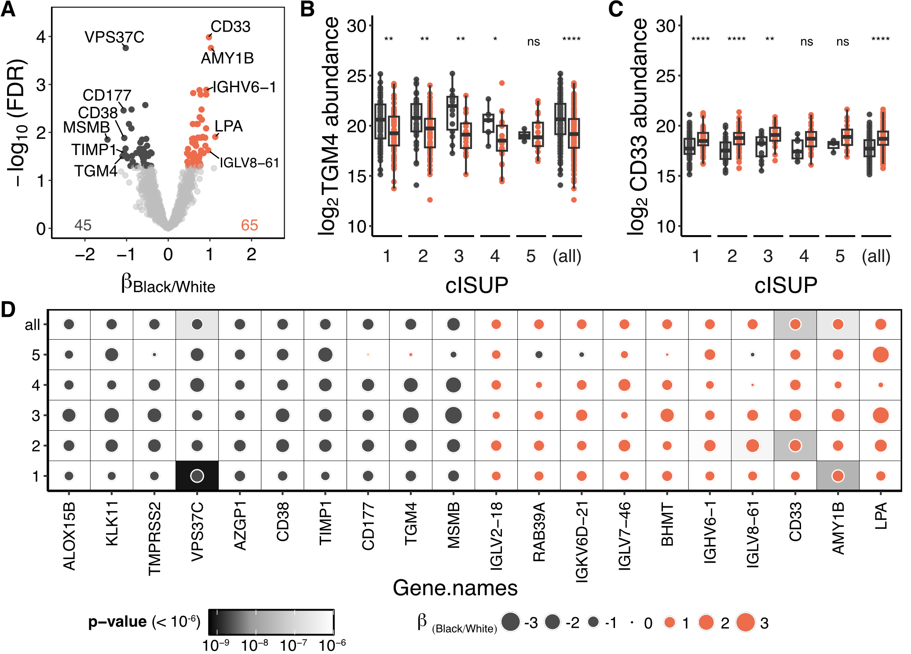
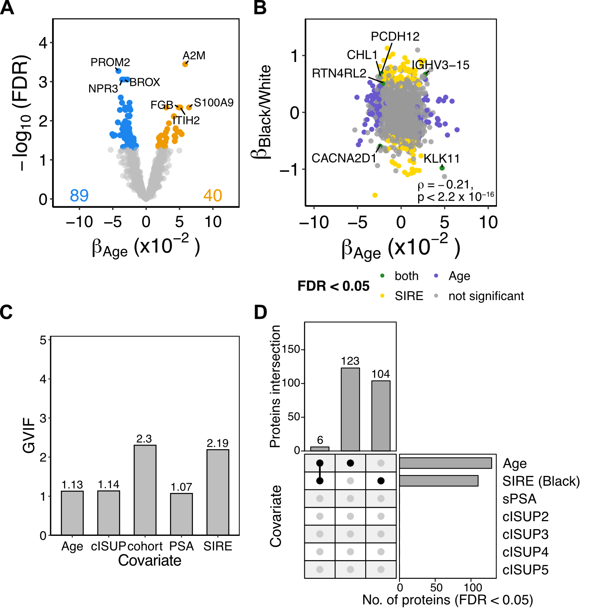

## Urine Proteome Vary by Ancestry in Localized Prostate Cancer Patients

Black men have higher prostate cancer incidence rates and greater risk of mortality compared to White men. While such disparity is multifactorial, there is growing evidence showing ancestry-driven molecular heterogeneity of prostate cancer. The reported heterogeneity suggests that race and ethnicity be considered a critical covariate when identifying potential biomarkers. Urine contains prostate-derived proteins that can reflect the physiological state of the prostate and is suitable for biomarker. However, the ancestry-driven racial and ethnic influences on the urinary proteome is understudied. Here, I investigated the variance of the urinary proteome between self-identified Black and White patients with localized prostate cancer to inform potential biases and considerations in urine biomarker development.

### 1. Clinically diverse cohort for assessing variance contributing factors

To assess the influence of self-identified race and ethnicity (**SIRE**) on the urine composition, we characterized the post-DRE urine protoeme from 329 patients with localized prostate cancer and evaluated differences that may contribute to the reported heterogeneity. The overview of cohort and processing workflow is shown below.

<picture>
 
</picture>

### 2. Race and ethnicity associations with the urinary proteome

As the molecular landscape of prostate cancer is influenced by variables such as age and tumour grade, a multivariable analysis adjusting for cISUP grade group (**GG**), age, and serum prostate-specific antigen (**sPSA**) level was used to quantify associations of urinary protein abundance with SIRE. 

$$lm(log_2 protein abundance ~ age + GG + sPSA + SIRE + cohort)$$

The multivariable linear regression model chosen revealed 110 proteins significantly associated with SIRE, with top-ranking proteins showing consistent SIRE-driven protein abundance changes across GG within stratified analyses. Notably, immune-related proteins are elevated in Black patient samples, while prostate-derived proteins are associated with White patient samples. The directionality of these effects is also independent of GG.

<picture>
  
</picture>

The multivariable analysis also uncovered 129 proteins significantly associated with age, independent from associations with SIRE (Hypergeometric test's p = 0.8229). To test the collinearity between covariates, generalized variance inflation factor analysis showed that all covariates are highly independent. Furthermore, proteins significantly associated with each variable are unique. Altogether, our data suggests that the urinary proteome is heavily influenced by age and SIRE, independent of other clinical variables.

<picture>
  
</picture>

To examine the correlation of urinary protein changes between SIRE and tumour aggressiveness, we assessed the effects between clinically significant (cISUP GG 2-5) and clinically insignificant tumours (cISUP GG 1). In stratified analysis within SIRE groups, protein abundance associations with tumour grades in Black patients are not correlated with those of White patients. We also observed that proteins elevated in clinically significant tumours are also preferentially elevated in Black patients within the same model.

<picture>
  >
</picture>

### 3. Integrative multi-omics analysis revealed immune dysregulation in Black patients

For more details see [article in preprint](https://doi.org/10.1101/2025.08.14.6703969).
