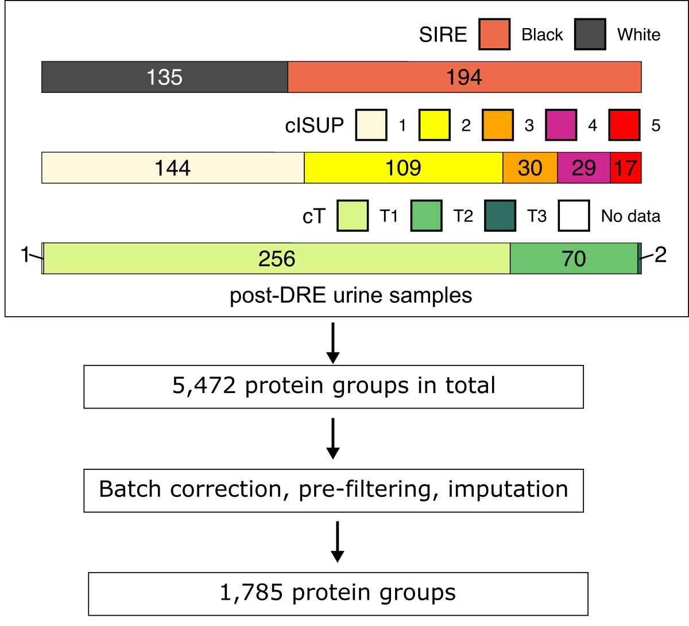

## Urine Proteome Vary by Ancestry in Localized Prostate Cancer Patients

Black men have higher prostate cancer incidence rates and greater risk of mortality compared to White men. While such disparity is multifactorial, there is growing evidence showing ancestry-driven molecular heterogeneity of prostate cancer. The reported heterogeneity suggests that race and ethnicity be considered a critical covariate when identifying potential biomarkers. Urine contains prostate-derived proteins that can reflect the physiological state of the prostate and is suitable for biomarker. However, the ancestry-driven racial and ethnic influences on the urinary proteome is understudied. Here, I investigated the variance of the urinary proteome between self-identified Black and White patients with localized prostate cancer to inform potential biases and considerations in urine biomarker development.

### 1. Clinically diverse cohort for assessing variance contributing factors

To assess the influence of self-identified race and ethnicity (**SIRE**) on the urine composition, we characterized the post-DRE urine protoeme from 329 patients with localized prostate cancer and evaluated differences that may contribute to the reported heterogeneity. The overview of cohort and processing workflow is shown below.

<picture>
 
</picture>

### 2. Benchmark various computational strategies for the most comprehensive results

Currently, there is no consensus of a database searching approach in DIA-MS. In the context of urine proteomics, I compared search results from various library generation approaches against a library-free algorithm and a publicly available library.

<picture>
  
</picture>

Across all the database searching approahces, the method using sample-specific library (uEPS) generated from individual DDA runs of each sample resulted in the most consistently detected peptides. The search times for this method is also less than 1 min per sample, enabling swift and efficient large-scale cohort analyses.

<picture>
  
</picture>

Therefore, altogether, the 45-minute DIA-MS method coupled with the sample-specific library search is chosen as the optimal method.
 

### 3. Comparison between 45-min DIA against conventional 2-hr DDA method

Having a 45-minute DIA method optimized for urine proteomics analysis, I sought to compare the resulting data matrix against our conventional 2-hr DDA method using the same samples. The results showed that our optimized DIA method was able to identify more peptides and proteins per sample, generate more complete (less missing values) dataset, as well as produce quantitatively comparable intensity compared to DDA.

<picture>
  
</picture>

Not only that DIA showed advantageous results in peptide and protein detection rates, it was able to detect more peptides and proteins that are of lower abundance, despite shorter gradient separation.

<picture>
  
</picture>

 
### 4. Expanding proteome depth using sample-relevant spectral libraries

While I have shown that DIA-MS can improve protein detection and sample throughput, lower abundance and less frequently detected prostate-derived proteins may be missed in spectral libraries derived from unfractionated urine due to the high dynamic range of the sample type. Leveraging previously published urine-derived extracellular vesicles (EV) dataset, we generated and compared results of DIA unfractionated data searched against various libraries from various urine fractions.

<picture>
  
</picture>

Using global pathway analysis to compare the ontology of identified proteins between the various spectral libraries, EV-related terms are enriched when using the EV-generated libraries as expected. On the other hand, using the unfractionated libraries enriched in terms for cytosolic proteins.

<picture>
  
</picture>

### 5. Generating a fully comprehensive prostate cancer urine spectral library

Given the benefits from using the spectral libraries derived from other urinary fractions, a combined library was generated using all of the urine spectral data available in the cohorts. Hence, a comprehensive combined library comprised of data from unfractionated urine, EVs is generated.

<picture>
  
</picture>

For more details see [published article](https://pubs.acs.org/doi/10.1021/acs.jproteome.4c00009).
