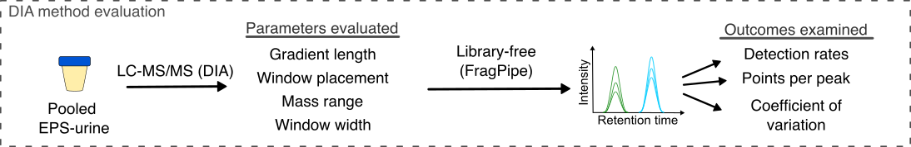

## Evaluation and Optimization of DIA-MS for Prostate Cancer Urine Proteomics Analysis

Biofluids such as urine contain molecules in circulation and from nearby organs that can be indicative of disease states. However, comprehensive profiling of the proteomes in urine has been challening due to high dynamic range and variability between samples. Data-independent acquisition mass spectrometry (DIA-MS) has been popularized over recent decades as a high throughput and sensitive bottom-up proteomics workflow with improved data completeness compared to conventional MS methods. Hence, characteirizing the proteome of patient-derived urines with DIA-MS is an emerging area of interest for biomarker discovery. Thus far, there is limited consensus on DIA-MS acquisition and analysis approaches. In this project, I benchmarked several published DIA-MS acquisition schemes, as well as various computational analysis workflows using a clinically heterogeneous cohort from patients with localized prostate cancer, to identify an optimal DIA-MS workflow for large-scale urine proteomics analyses.

### 1. Optimize DIA-MS acquisition scheme for improved throughput

To evaluate various published DIA-MS methods, I evaluated metrics such as the peptide and protein detection rates, coefficient of variations, using pooled patient urine samples.

<picture>
  
</picture>

In total, I tested 25 methods (each in triplicates) across various liquid chromatography run time to identify a method that can be comparable to conventional DDA-MS with higher throughput. We identified a 45-minute method that is double the throughput without loss in peptide detection.

<picture>
  
</picture>

### 2. Benchmark various computational strategies for the most comprehensive results

Currently, there is no consensus of a database searching approach in DIA-MS. In the context of urine proteomics, I compared search results from various library generation approaches against a library-free algorithm and a publicly available library.

<picture>
  
</picture>

### 3. Support the selection of appropriate statistical tools and techniques

### 4. Provide a basis for further data collection through surveys or experiments

Sed ut perspiciatis unde omnis iste natus error sit voluptatem accusantium doloremque laudantium, totam rem aperiam, eaque ipsa quae ab illo inventore veritatis et quasi architecto beatae vitae dicta sunt explicabo. 

For more details see [GitHub Flavored Markdown](https://guides.github.com/features/mastering-markdown/).
